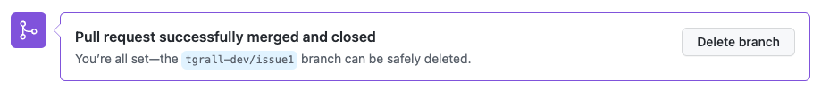

# 1 - Organizations, Repositories and Projects

In this section you will learn about GitHub [Organization](https://docs.github.com/en/enterprise-cloud@latest/organizations/collaborating-with-groups-in-organizations/about-organizations), [Repositories](https://docs.github.com/en/enterprise-cloud@latest/repositories) and [Project](https://docs.github.com/en/enterprise-cloud@latest/issues) (aka [GitHub Issues](https://docs.github.com/en/enterprise-cloud@latest/issues)).


Administrator (Owner) of the organization is reponsible of configuring the permissions, the policy, give access to the users (using or not SSO/SAML).

An organization contains many Repositories, where developer and project leader will collaborate on code, CI/CD and more. In a later step you will create your own repository to learn how to use GitHub,

Organization is a good place to manage your project using Board.

---
## 1.1 Lab : Create your Project Board

Follow the steps, in the Organaization, from:
- [Quickstart for projects](https://docs.github.com/en/issues/trying-out-the-new-projects-experience/quickstart)

Note: for the training, when creating issue (draft or not), put your `handle` (login) in the description.


Additionnal resources:
- Blog : [Getting started with project planning on GitHub](https://github.blog/2022-02-11-getting-started-with-project-planning-on-github/)
- Documentation: [GitHub Issues](https://docs.github.com/en/issues)


---
## 1.2 Lab : Create your first repository in the organization

1. On any GitHub page, click on your avatar, then select **Your Organizations**.
2. Select the workshop organization 
3. Click on the **`New`** button
4. Enter the following informations for the creation
    - Repository Name: `<your-handle>-first-repo` _(example `tgrall-first-repo`)_
    - Description: any
    - Visbility : **Private**, (Public option is grayed, from the organization policy to avoid exposing your code to the public by "error" )
    - **Add a README file** : check
    - **Add .gitignore**: select **node**
    - **Choose a license** : any, for example MIT
        
        


---
## 1.3 Lab : Code your application

For this part of the lab, you will create a very basic Node/Javascript application. No need to be an expert, the idea is to discover how to contribute to a project.

During the training you will be using the **[GitHub Flow](https://docs.github.com/en/get-started/quickstart/github-flow)** to modify your code and collaborate to projects.

### Create an issue

Let's start by creating a new issue in your project:

1. Click on **Issues** in your Repository
2. Create **New Issue**
3. Enter " 👋 -[your handle] Say Hello World" in the title and description. _You can drag and drop images or video in the body of the issue._
4. Click **Submit new issue**
5. On the **Assignees** and clock **assign yourself**

The issue is now created, it is time to work on it.

### Implement your features

In the traditional way, you will clone the code locally using `git clone` command or some client tools (your IDE, [GitHub Desktop](https://desktop.github.com/)), using GitHub Cloud you have a unique way using [GitHub Codespaces](https://github.com/features/codespaces).

You will see that you do not need to install anything to develop/contribute to a project.

1. Click on the **Code** button
2. Select **Codespaces**
3. Click **New Codespaces**

This will create a new Development environment, based on VS Code editor. As you can see, you have a full IDE in your browser.


**Create a development branch**

Once you are in Codespaces, you should create a development branch, this could be done from CLI, using the Git extension, or even better by saying that you are starting to work on a issue.

In the Codespaces left bar, click on the GitHub Logo, and select and **Issues**


This will create a new branch in `git`, you can go in the terminal and run the command `git branch`, you should see:

```
$ git branch


@your-user ➜ /workspaces/your-user-first-repo (your-user/issue1 ✗) $ git branch
  main
* your-user/issue1
```

You are not on your "feature branch", where you will be modifying code.


**Initialize node project with npm.**

In Codespace terminal run the following commands to initialize your `node.js` project


```bash
$ npm init
```

Keep all the defaults


**Install Express dependencies**

```bash
$ npm install express --save
```

**Create the index.js**

Click on the "Expore"  button in the tool bar.

Using the IDE create a new file names `index.js` and add the following content:

```js
const express = require('express')
const app = express()
const port = 3000

app.get('/', (req, res) => {
  res.send('Hello World!')
})

app.listen(port, () => {
  console.log(`Example app listening on port ${port}`)
})
```


If you are not familiar with Node and Express, the code is:

- Importing dependencies
- Create a Route
- Start HTTP Server on port 3000


**Test the application from GitHub Codespaces**

You code is "ready", you can now test the application.

Go in the terminal and run the following command:

```bash 
$ node index.js
```

This will start the Web server, and Codespaces will open automatically make the port 3000 accessible, you can click on the bottom right button **Open In Browser**.


You can also go in the **Ports** tab and open the application from there.

As you can see you are able to develop entirely in your browser and even test your application from the cloud.


**Commit changes**

You are now ready to commit your change in your feature branch, the next step is to:
- commit the code
- push the code to GitHub
- Create a pull request for collaboration/review

You can do this using the CLI in the terminal or using the `git` extension in Codespaces (see [documentation](https://code.visualstudio.com/docs/editor/versioncontrol#_commit)).

Let's use the CLI in the terminal: (if the server is still running press `ctrl+C` to stop it)

```
$ git status

$ git add .

$ git commit -m "first server - issue #1"

$ git push origin <your branch> 

$ git status

```

This will create the new branch in GitHub and push the code.

---
## 1.4 Create a new Pull Request

In Codespaces, click in the menu and **Go To Repository**


In GitHub, you should have a message at the top inviting you to create a Pull Request (PR).


Click on the **Compare & pull request** button to create the PR.

Add some information in the PR and click the **Create pull request** button. If you look in the dropdown list of the button you will see that you can also create a *Draft PR*, this could be very interesting when you are at the beginning of your work or, doing some experirmentation.

As mentioned during the training, it is good to create the PR early in the process, to share your work with your co-worker but also to run the CI/CD and other automation process as early as possible.

**Ask for Review**

You can ask somebody to review the PR by selecting the one or multiple Reviewers. This wil allow user to review and comment the code, and eventually approve the changes.


On the PR, you can open a Codespaces from the **Code** button. this make easy the collaboration on the PR/branch.

**Merge the code**

In this lab, the review is optional, in real life project you should make the review process mandatory.

Once the review is done, and the PR accepted you can click on **Merge pull request** button.

If you have not linked the issue to the pull request, you can still close the issue automatically with a comment for example

```
close #1
```

This will:

- merge you code from the feature branch to the main branch
- close the issue associated to the pull request.

**Delete the branch**

You are now all set, you can delete the development branch, click the **Delete branch** button.




**Delete the Codespaces**

Codespaces is billed based on the compute "*when you are using it*", and  storage "*when the environment is stored on disk*", more information in the documentation:

- [Understanding billing for Codespaces](https://docs.github.com/en/codespaces/codespaces-reference/understanding-billing-for-codespaces)

So it is a good practise to delete Codespaces when you do not need it anymore. Keeping in mind that you can recreate a new one with a simple click!

To delete your Codespaces, go to: https://github.com/codespaces

You have now the list of all Codespaces you have created and using.

Click on the **`[...]`** button then **Delete**.


---
## Conclusion Lab 1

In this first lab you have learned, how to:

- 👏  Create a project board
- 👏  Add some issues
- 👏  Create a new repository, in an Organization managed by an Enterprise, perfect for internal and customer work
- 👏  Use GitHub Codespaces to add some code.


**Additional GitHub Training:**

- [Managing merge conflicts](https://lab.github.com/githubtraining/managing-merge-conflicts)
- [Connect the dots in a GitHub repository](https://lab.github.com/githubtraining/connect-the-dots-in-a-github-repository)
- [Reviewing Pull Request](https://lab.github.com/githubtraining/reviewing-pull-requests)

----

Next : 
  - **[Documentation with GitHub Pages](002-documentation-with-github-pages.md)**