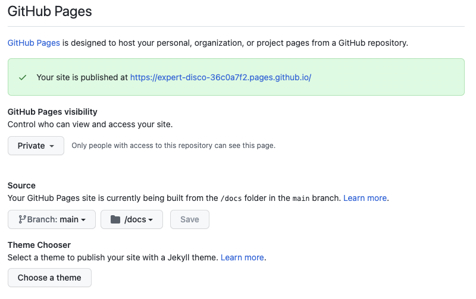

# 2 - Documentation with GitHub Pages

Using GitHub Pages you can create Websites for your projects, for example to publish documentation.

The sites are direcly hosted from the GitHub repository.

Just edit, push, and your changes are live!

In this Lab you will add, and publish documentation to the repository you have created in the previous step.

----

### 1 - Create a `docs` folder and content

Go back to the main page of your repository.

Using a **new Codespaces**, or the editor create a new file with some markdown content.


- File: `/docs/index.md`

    ```md

    ## Documentation for my project

    This is an example of documentation

    ### Sample code

    - Sample code:

        ```js
            console.log("Simple code!");
        ```
    ```

- **Commit and push** the changes in `main` branch

---
### 2 - Enable GitHub Pages in your repository

- Go to the repository you have created, and click **Settings**
    
    Select the `main` branch, and the `docs` folder
    
    


    GitHub is now using GitHub Actions to build and publish the pages, you can go to the "Actions" tab of you repository to see the process.

---
### 3 Making changes

- Using Codespaces or other methods modify the `/docs/_config.yml` content

- You can also change the title and description, edit the `/docs/_config.yml` file with the following content:

    ```yml
    theme: merlot
    title: "<YOUR NNAME> - project homepage"
    description: "Great documentation about my project!"
    ```

- When you're done, click **Commit changes** and your updates will go live in just a few seconds!
    
    
You can find more informations on the page:
- [Adding a theme to your GitHub Pages site using Jekyll](https://docs.github.com/en/pages/setting-up-a-github-pages-site-with-jekyll/adding-a-theme-to-your-github-pages-site-using-jekyll)

## Conclusion Lab 2

In this lab you have learned, how to:

- 👏 Use Markdown to create content
- 👏 Create a site for your project using GitHub Pages
- 👏 Configure GitHub Pages


----

**Additional GitHub Content & Training:**

- [GitHub Pages](https://pages.github.com/)
- [GitHub Pages Documentation](https://docs.github.com/en/enterprise-cloud@latest/pages)
- [Personal Site with GitHub Pages](https://docs.github.com/en/enterprise-cloud@latest/pages/quickstart)
- [GitHub Pages](https://lab.github.com/githubtraining/github-pages)


----

Next : 
  - **[Create your community](003-create-community-with-github-discussion.md)**
