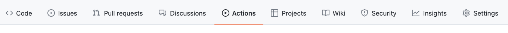
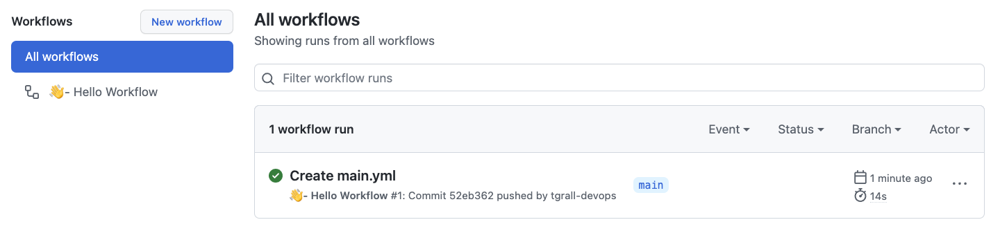
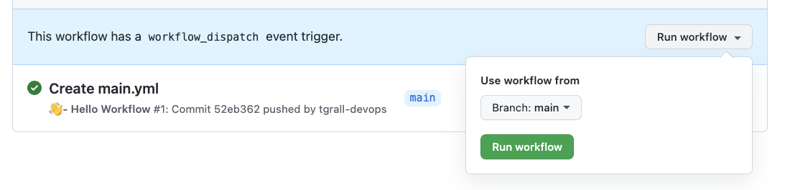
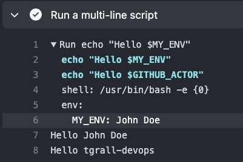
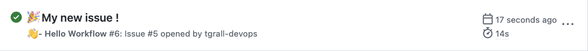
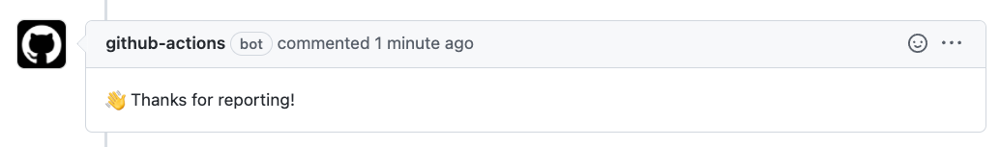

# 4 - Automation with GitHub Actions

GitHub Actions is a continuous integration and continuous delivery (CI/CD) platform that allows you to automate your build, test, and deployment pipeline. You can create workflows that build and test every pull request to your repository, or deploy merged pull requests to production.

GitHub Actions goes beyond just DevOps and lets you run workflows when other events happen in your repository. For example, you can run a workflow to automatically add the appropriate labels whenever someone creates a new issue in your repository.

GitHub provides Linux, Windows, and macOS virtual machines to run your workflows, or you can host your own self-hosted runners in your own data center or cloud infrastructure.

**The components of GitHub Actions**

You can configure a GitHub Actions workflow to be triggered when an event occurs in your repository, such as a pull request being opened or an issue being created. Your workflow contains one or more jobs which can run in sequential order or in parallel. Each job will run inside its own virtual machine runner, or inside a container, and has one or more steps that either run a script that you define or run an action, which is a reusable extension that can simplify your workflow.


Mote about [GitHub Actions & Workflows components](https://docs.github.com/en/actions/learn-github-actions/understanding-github-actions#the-components-of-github-actions)

## 1 - Implement your first workflow with Actions


### Create your workflow file in `.github/workflows/`


In your Repository click on the **Actions** page




You see a list of suggestions, for example to do some CI/CD for Node. GitHub has recognized that your project has some Javascript code.

However, we will start with a custom workflow, click on: **set up a workflow yourself** 

Change the `name` of the workflow to:

```yml
name: "👋  - Hello Workflow"
```

<details>
<summary>Workflow file `hello.yml`</summary>

```yml

# This is a basic workflow to help you get started with Actions

name: "👋  - Hello Workflow"

# Controls when the workflow will run
on:
  # Triggers the workflow on push or pull request events but only for the main branch
  push:
    branches: [ main ]
  pull_request:
    branches: [ main ]

  # Allows you to run this workflow manually from the Actions page
  workflow_dispatch:

# A workflow run is made up of one or more jobs that can run sequentially or in parallel
jobs:
  # This workflow contains a single job called "build"
  build:
    # The type of runner that the job will run on
    runs-on: ubuntu-latest

    # Steps represent a sequence of tasks that will be executed as part of the job
    steps:
      # Checks-out your repository under $GITHUB_WORKSPACE, so your job can access it
      - uses: actions/checkout@v2

      # Runs a single command using the runners shell
      - name: Run a one-line script
        run: echo Hello, world!

      # Runs a set of commands using the runners shell
      - name: Run a multi-line script
        run: |
          echo Add other actions to build,
          echo test, and deploy your project.

```

</details>


Rename the file `hello.yml` and click **Start Commit**, exceptionnaly let's commit on the `main` branch.

> **About workflows**
>
> You can create a workflow file configured to run on specific events. For more information, see "[Configuring a workflow](https://docs.github.com/en/actions/using-workflows)" and "[Workflow syntax for GitHub Actions](https://docs.github.com/en/actions/using-workflows/workflow-syntax-for-github-actions)".


### See Workflow runs

CLick on the **Actions** page, you will see the runs of your workflow



### Run the workflow Manually

The workflow you have created, has the following `workflow_dispatch` event as source, this means you can run it manually.

```yml
on:
  ...
  # Allows you to run this workflow manually from the Actions page
  workflow_dispatch:
```

For this in the **Actions** page, select the "👋  - Hello Workflow" workflow in the left list, and click on **Run workflow** button.




Refresh the page, or wait few seconds, you will see the result of your run.


## 2 - Analyze your workflow

In the list of Workflow runs, click on one of the run, you should see a "job" called `build`.

Click on the job, you will see the its log.

Click on `Run a multi-line script`, you will see the result.


## 3 - Use Environment variables and context

Edit the workflow and add the following lines:

Add an environment variable at the job level

```yml
    build:
        env:
            MY_ENV : "John Doe"
```

Use you environment variabe and a default one in a step

```yml

      - name: Run a multi-line script
        run: |
          echo "Hello $MY_ENV"
          echo "Hello $GITHUB_ACTOR"   

```

Commit your changes, that will execute a new run, you should see the following in the log:




More about environment variable and default variables:

- [Environment variables](https://docs.github.com/en/actions/learn-github-actions/environment-variables)


## 4 - Run workflow on new Event

GitHub Actions workflows can be executed on many events:
- [Events that trigger workflows](https://docs.github.com/en/actions/using-workflows/events-that-trigger-workflows)

In the next step you will modify the workflow to execute it when a new issue is created,

Update the workflow and add the following in the `on` section:

```yml
...

on:
  issues:
    types: [opened, edited]

...
```

Commit the change.

Then create an issue in your repository.

Go to the Actions page where you should see the run




## 5 - Interact with GitHub from your Actions

GitHub has many API you can use to control almost everything programmatically. This API can be used in your workflow.

In the following steps, you will comment the issue that triggered the workflow using GitHub API.


You will do the following:

- add a new step
- this step should be executed only when triggered from an issue
- comment the issue from the workflow


Edit the workflow and add the following step at the end of the file.


```
      # Comment issue
      - name: " 🔖  Comment issue"
        if: ${{ github.event.issue}}  
        uses: actions/github-script@v6.0.0
        with:
          github-token: ${{secrets.GITHUB_TOKEN}}
          script: |
            github.rest.issues.createComment({
              issue_number: context.issue.number,
              owner: context.repo.owner,
              repo: context.repo.repo,
              body: '👋 Thanks for reporting!'
            })
```

Commit the file.

You will see a new run from the `push`, the step you just added should be ignore thanks to `if: ${{ github.event.issue}}` line.

Then create a new issue in the repository, the  run will add a new comment to the newly created issue.




## Conclusion


In this lab you have learned, how to:

- 👏 create a new workflow for automation.
- 👏 Run automation on various events : Push, Issue, ...
- 👏 Interact with GitHub, for example automatically create a new comment in an issue.


Let's now use GitHub Actions to create CI/CD (Continuous Integration/Continuous Deployment) pipelines.


---

Next : 
  - **[Continuous Integration](005-ci-with-github-actions.md)**
