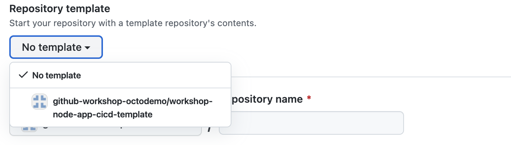
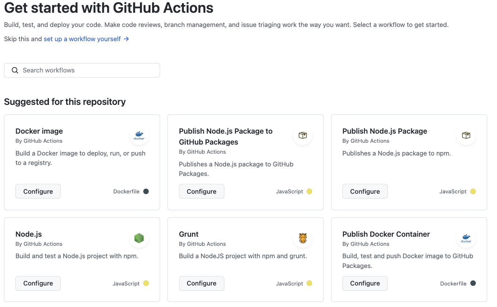
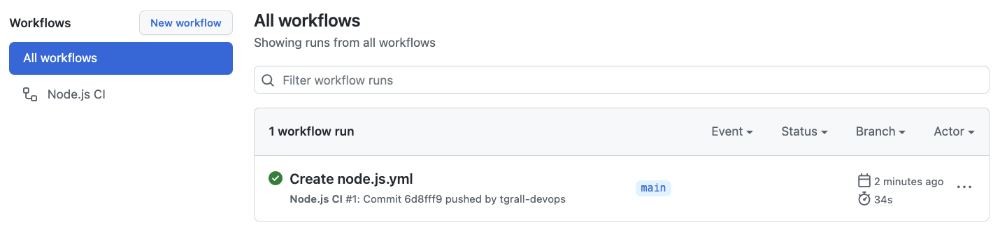
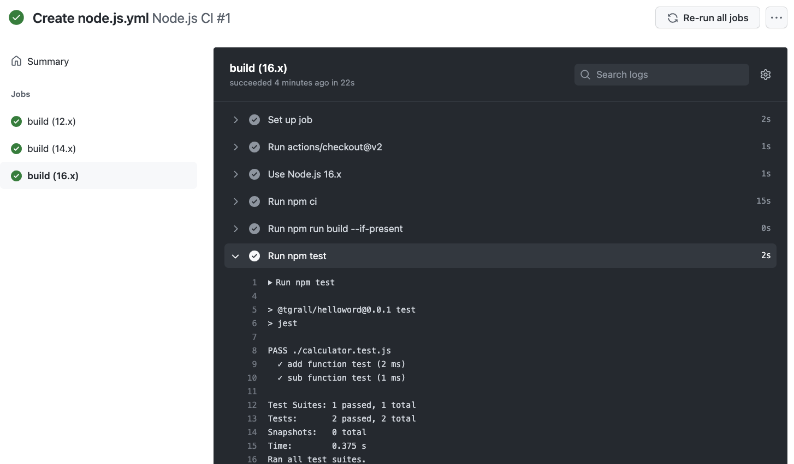
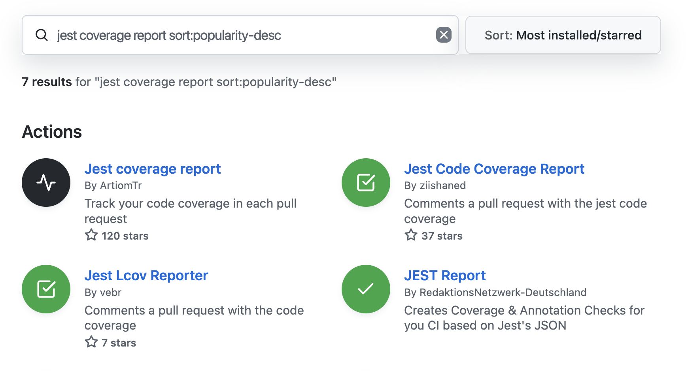
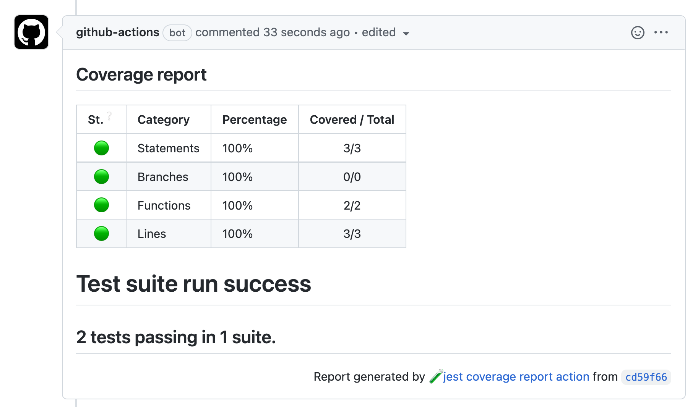

# 5 - Continuous Integration with GitHub Actions

For this lab, you will create a new repository from a template to have some Test and Docker file. This will allow everybody to be at the same starting point.


## 1 - Create a new Repository from template

Go to the workshop organization page

Click the **New** button.

Select the template **node-app-cicd-template**.



Select **all branches**.

Enter a repository name prefixed by your name, for example: `<your-name>-node-app-calculator`.


### Inspect the new repository

The new repository contains an extended version of the application you have created previously:

- `calculator.js` : contains a small _library_ with `add()` and `sub()` functions
- `calculator.test.js` : contains the `jest` tests for the 2 functions
- `index.js` : add a new endoint `/add/3/5` that calls the add() function
- `Dockerfile` : a Docker file that package the application in a container.

If if you want to test the application you can start a Codespaces and run the application (npm start) or test


## 2 - Add Continuous Integration

To develop a GitHub Workflow process that employs Actions to automate the Continuous Integration process, you can begin by adding starter workflow file to the .github directory. On the initial view of your repository, find and navigate to the **Actions** tab.




On the Actions page you should see 3 JavaScript workflow options. Find the Node.js (the one that is not a Package) option and click the **Configure** this workflow button.

Commit the `nodejs.yml` file to the `main` branch to complete this process of creating our first CI workflow.


<details>
<summary>The `.github/workflows/` folder will include the contents from below:</summary>


```yml
name: Node.js CI

on:
  push:
    branches: [ main ]
  pull_request:
    branches: [ main ]

jobs:
  build:

    runs-on: ubuntu-latest

    strategy:
      matrix:
        node-version: [12.x, 14.x, 16.x]

    steps:
    - uses: actions/checkout@v2
    - name: Use Node.js ${{ matrix.node-version }}
      uses: actions/setup-node@v2
      with:
        node-version: ${{ matrix.node-version }}
        cache: 'npm'
    - run: npm ci
    - run: npm run build --if-present
    - run: npm test
```
</details>


Take note that our workflow is running a strategy with 3 versions of node, [12, 14 and 16]. 

### Check runs

Your new Actions CI is running on everything push, you should already have a workflow running.



Note that we will need to run a test to run as part of our CI, Find the `calculator.test.js` file with the contents from below:

```js
const calculator = require('./calculator');

// test for add function
test('add function test', () => {
    expect(calculator.add(1, 2)).toBe(3);
    expect(calculator.add(2, 2)).toBe(4);
    expect(calculator.add(3, 2)).toBe(5);
});


// test for sub function
test('sub function test', () => {
    expect(calculator.sub(1, 2)).toBe(-1);
    expect(calculator.sub(2, 2)).toBe(0);
    expect(calculator.sub(3, 2)).toBe(1);
});
```

The result of that last push to main should look like this image:




## 3 - Add Code Coverage to your workflow


It is common when workin on the CI part of your project to add more informations to the user, for example tests "*code coverage*".

The approach is quite simple with GitHub Actions, you decide where/when you want to do a specific task, and you search for a specific action in the [GitHub Marketplace](https://github.com/marketplace?category=&query=&type=actions&verification=).

### 3.1 - Find an action in the Marketplace

1. Search an action in the GitHub Marketplace:  `jest coverage report`

2. Select the action with the most stars
  

3. Click on the **Jest coverage report 🧪** action.

4. You can read the documentation, and integrate it to your workflow.


### 3.2 - Update the worklow

1. In the `main` branch, edit the CI workdlow `.github/workflows/node.js.yml`

2. Add a new job to create a Test Coverage report
  ```yml
 coverage:
      runs-on: ubuntu-latest
      steps:
          - uses: actions/checkout@v3
          - uses: ArtiomTr/jest-coverage-report-action@v2
            id: coverage
            with:
                output: report-markdown
          - uses: marocchino/sticky-pull-request-comment@v2
            with:
                message: ${{ steps.coverage.outputs.report }}
  ```

3. Commit the `node.js.yml` file.


### 3.3 - Create a new Pull Request

1. Go to the main page of the repository.

2. Click on `index.js`, and edit the file (add a comment for example).

3. Scroll down,and click **Create a new branch for this commit and start a pull request**. 

4. Click **Propose Changes**.

5. Click **Create pull request**.

6. Wait for the CI to run and you will see a new comment in your pull request with some code coverage.



## Conclusion

In this lab you have learned how to:

- 👍 Add a new workflow for CI.
- 👍 Search a new action, for Code Coverage.
- 👍 Add new action to your workflow.

---

Next : 
  - **[Continuous Delivery/Deployment with GitHub Actions](006-cd-with-github-actions.md)**