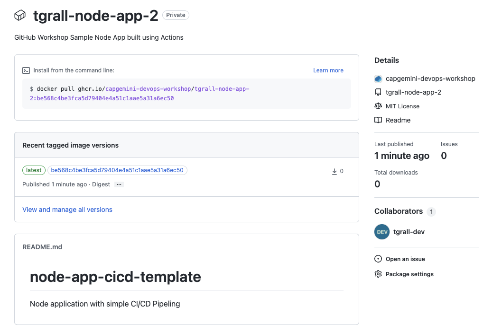

# 6 - Continuous Deployment/Delivery with GitHub Actions

In the previous lab, you have use GitHub Actions to create Continuous Integration (CI) workflow. Another part of your project is to deliver/deploy applications.

In this lab you will extend the workflow you have created to package the application as a Container Image and publish it inside GitHub Container Registry, so a **delivery** process.

You could also **deploy** the application for example in a cloud service like Azure Kubernetes Service (AKS), or other systems. For the lab we do not have target environment, so you will stop at the delivery step (publishing the image to registry).

## 1 - Using the visualization graph

Every workflow run generates a real-time graph that illustrates the run progress. You can use this graph to monitor and debug workflows. The graph displays each job in the workflow. An icon to the left of the job name indicates the status of the job. Lines between jobs indicate dependencies.


## 2 - Dependent jobs

By default, the jobs in your workflow all run in parallel at the same time. So if you have a job that must only run after another job has been completed, you can use the needs keyword to create this dependency. If one of the jobs fails, all dependent jobs are skipped; however, if you need the jobs to continue, you can define this using the if conditional statement. In this example, the build, and publish-container jobs run in series, with publish-container dependent on the successful completion of the job that precedes it:

```yml
jobs:
  build:
    needs: setup
    runs-on: ubuntu-latest
    steps:
      # Build node application
      - ...
        ...

  coverage:
    ...

  publish-container:
    # Depends of build
    needs: build
    runs-on: ubuntu-latest
    steps:
      # Build and publish Docker
      - ...
        ...
```

## 3 - Environments
You can configure environments with protection rules and secrets. When a workflow job references an environment, the job won't start until all of the environment's protection rules pass. A job also cannot access secrets that are defined in an environment until all the environment protection rules pass. 

We wont cover this in this lab, but you can learn more about environments using the following links:

- [Using environments for deployment](https://docs.github.com/en/actions/deployment/targeting-different-environments/using-environments-for-deployment)
- [Getting Started with GitHub Environments](https://www.youtube.com/watch?v=nI6pRfH7VTc)


## 4 - Add Delivery job to your workflow

For the delivery, you will have to do the following steps:

1. Create a new Job that depends of the `build` job
2. Add steps to build and publish a container image.

When you are building workflows and you need to do specific tasks you should always look into the GitHub Marketplace to see if an action exists to do it.

#### GitHub Marketplace

1. Go in GitHub Marketplace: https://github.com/marketplace
2. Search for "Docker"
3. Scroll down to Actions, in the bottom of the page

You can see many actions related to Docker, for this lab you will use the following actions:

- [Docker Login](https://github.com/marketplace/actions/docker-login) : to connect to GitHub Container Registry (https://ghcr.io)
-[Build and push Docker images](https://github.com/marketplace/actions/build-and-push-docker-images)


### 4.1 - Edit the workflow

1. Edit the file `.github/workflows/node.js.yml`, and add the following code to the YAML:
  ```yaml
    build-publish:
      name: "🐳  Build and Publish Container Image"
      needs: [build]
      runs-on: ubuntu-latest
      steps:
      
      # Get the source code to build the image
      - uses: actions/checkout@v2

      # Login against a Docker registry except on PR
      # https://github.com/docker/login-action
      - name: Log into registry ${{ env.REGISTRY }}
        if: github.event_name != 'pull_request'
        uses: docker/login-action@v1.13.0
        with:
          registry: ghcr.io
          username: ${{ github.actor }}
          password: ${{ secrets.GITHUB_TOKEN }}

      # Build and push Docker image with Buildx (don't push on PR)
      # https://github.com/docker/build-push-action
      - name: Build and push Docker image
        id: build-and-push
        uses: docker/build-push-action@v2.9.0
        with:
          context: .
          push: ${{ github.event_name != 'pull_request' }}
          tags: |
            ghcr.io/${{ github.repository }}
            ghcr.io/${{ github.repository }}:${{ github.sha }}
  ```


2. Commit the `.github/workflows/node.js.yml` file.


3. Workflow will automatically start on Push and the workflow will do the full CI/CD process.

4. Look into the Workflow Runs and inspect the "Build and Publish Container Image" job

## 5 - Find your image in GitHub Container Registry

1. Go to your project main page

2. Click on the **Packages** link in the right menu

3. Click on your container




## Conclusion

In this lab you have learned how to :

- 👏 Build and Publish a Container Image using GitHub Actions
- 👏 Navigate to GitHub Packages


---

Next : 
  - **[DevSecOps with GitHub](007-devsecops-vulnerabled-dependencies.md)**