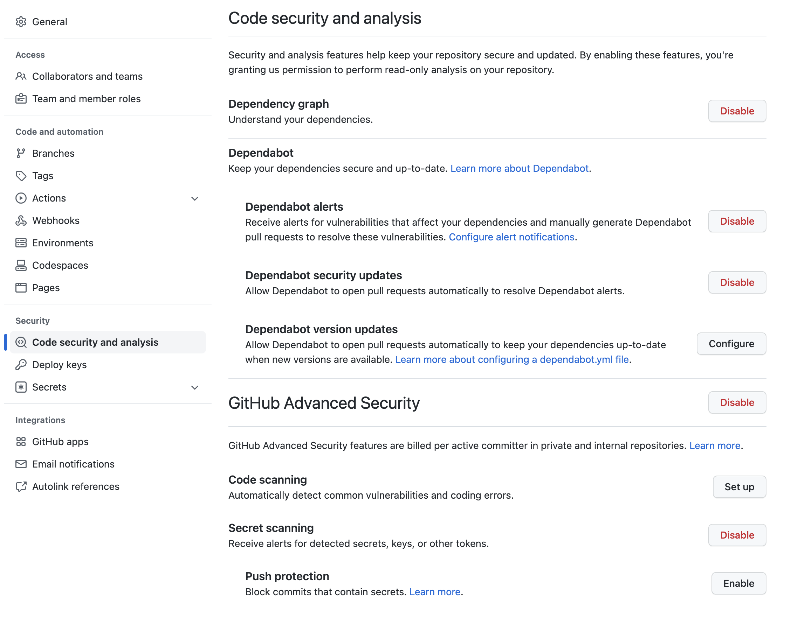
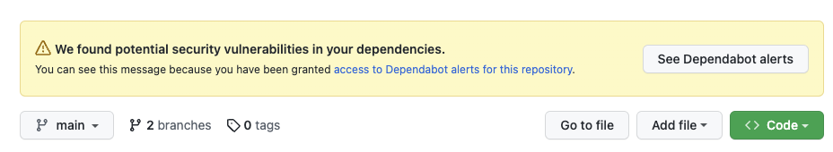
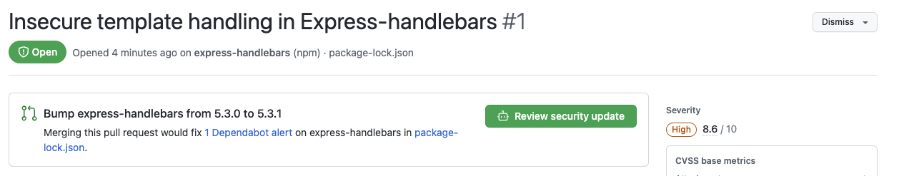
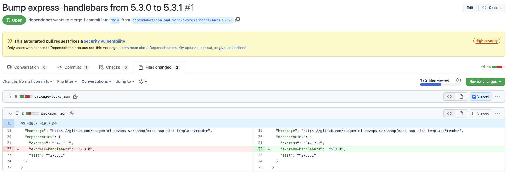
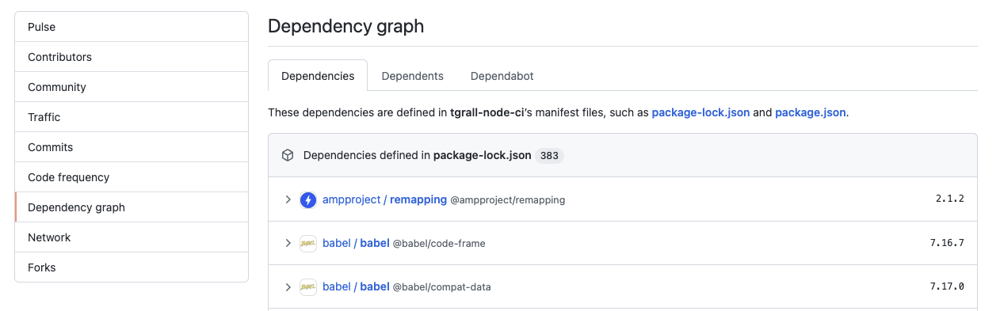

# 7 - DevSecOps with GitHub : Vulnerable Dependencies 

From the repository you have created using the template `node-app-cicd-template`, you will now add security features to the project.

This section is designed to get you familiar with **GitHub Advanced Security** (GHAS) so that you can better understand how to use it in your own repositories. You will use GitHub Advanced Security features like **code scanning** and **secret scanning** to detect vulnerabilities, and see how to use automation to detect these issues before they reach production, in addition to **dependencies scanning** to find vulnerabilities to the library you are using in your repository.

## 1- Enable Security Features

Go to the **Settings** tab of your repository, and click on **Code security and analysis** in the left menu.

**Enable** all features, except "Protect Push" in the" Secret Scanning" section _(You will Set up code scanning later in this lab)_

> Note: 
>   - These features are usually enabled by default by your Organization administrator
>   - All these features are available freely for all public repositories.

Go back to the main page (**Code**) of you repository.

## 2 - Detect dependencies vulnerabilities affecting your repository.

Dependabot is a tool that automatically control your project and will alert you when vulnaribility is found.

You can see this alert box in your project:

> Note: This alert is coming from a library that has been added for demo/learning purpose

1. Click on **See Dependabot alerts** button
2. Click on the alert
3. The dependabot alert provides information to help you understand the source of the problem, and how to remediate.

### 2.1 - Remediate with Dependabot Pull Request

When Dependabot finds a security alert, it creates a new Pull Request automatically with the fixed versionfo the library you are using.

Click on the **Review security update** button to go into the Pull Request.

Look in the **File changed**, you can see the diff between the `main` branch and the one created by dependabot (`dependabot/npm_and_yarn/express-handlebars-5.3.1`).

Go back to the **Conversation** tab to merge the pull request.

Click on **Merge pull request**.

Click **Confirm merge**.

This will merge the code into `main`, and execute all the Actions workflows associated with the push in main branch. 

> Note: Dependabot is automatically deleting the branch created by the alert.

Dependabot will also create Pull Request when a new version of a library you are using is available, keeping all dependencies up-to-date is a good way to keep your applications secured.

## 3 - Exploring the dependencies of a repository

You can use the dependency graph to see the packages your project depends on and the repositories that depend on it. In addition, you can see any vulnerabilities detected in its dependencies.

- Navigate to the main page of the repository.
- Under your repository name, click **Insights**.
- In the left sidebar, click **Dependency graph**.

You can look at all the dependencies of your project by ecosystem.

More information [here](https://docs.github.com/en/code-security/supply-chain-security/understanding-your-software-supply-chain/exploring-the-dependencies-of-a-repository).

## Conclusion

👏  You are done, you have remediated this dependency alert very quickly with the help of Dependabot!

In this example you have seen how easy si to fix a `Node.js` dependencies vulnaribily from Npm. Dependabot supports many other ecosystems; see [Documentation](https://docs.github.com/en/code-security/supply-chain-security/keeping-your-dependencies-updated-automatically/configuration-options-for-dependency-updates#package-ecosystem).

---

Next : 
  - **[DevSecOps with GitHub : Code Scanning](008-devsecops-code-scanning.md)**
