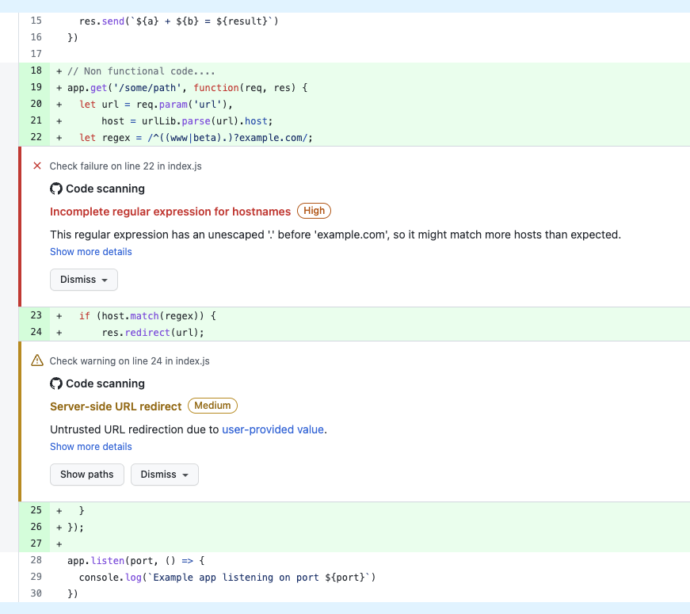

# 8 - DevSecOps with GitHub : Code Scanning

You can use code scanning to find security vulnerabilities and errors in the code for your project on GitHub.

Code scanning uses GitHub Actions. You can set up code scanning to use the CodeQL product maintained by GitHub or a third-party code scanning tool.

In the following steps, you will be using [CodeQL](https://docs.github.com/en/code-security/code-scanning/automatically-scanning-your-code-for-vulnerabilities-and-errors/about-code-scanning-with-codeql).

## 1 - Create a Code Scanning workflow

1. Navigate to the main page of the repository.

2. Under your repository name, click **Security**.

3. To the right of "Code scanning alerts", click **Set up code scanning**. 
  

4. Click on the **Configure CodeQL alerts**. 
   > *Note: GtHub allows you to integrate other scanning tools to your workflow (Terraform, Kubernertes, Container, API, ...)*

5. Use the **Start commit** drop-down, and type a commit message.

6. You can look at the `codeql-analysis.yml` workflow file.

    This workflow will be executed on each push on the `main` branch, related pull requests, and once every week (`- cron: '23 12 * * 6'`).

    The job `analyze` configure CodeQL and analyze the source code.


The scanning automatically happened when you committed the file. You can go to the **Actions** tab and look at the **Perform CodeQL Analysis**.

  


## 2 - Add some code, and create a new pull request

### 2.1 - Create a new branch

1. Click on **Code** button
2. Create a **New Codespaces**.
3. Click on the `main` branch, in the Codespaces bottom bar and creatre a new branch `code-scanning`
  
4. Check that you are on the new branch.
  


### 2.2 - Add some code

1. Open the `index.js` file.
2. Add the following code that redirects the browser to a new URL.
  ```js
  // Non functional code....
  app.get('/some/path', function(req, res) {
    let url = req.param('url'),
        host = urlLib.parse(url).host;
    let regex = /^((www|beta).)?example.com/;
    if (host.match(regex)) {
        res.redirect(url);
    }
  });
  ```
3. Save the file.


### 2.3 - Commit, push the changes and create a new PR

1. In the terminal:
  ```sh
    git add .

    git commit -m "add new code for codeql"

    git push origin code-scanning
  ```

2. Go to the repository and **create a new Pull Request**.

3. The PR will run all the worflows, including the **CodeQL Scanning** one.

4. When the workflows are done, you should see the CodeQL Scanning with a red cross. 
This indicates that one of the check has failed.
  


#### Analyze the security alert.

The Code Scanning action has added new comments in the PR conversation pointing to some vulnaribility in your code.


  


You can see 2 annotations around code scanning, one of them **High**, the other **Medium**.

Before going into the fix lets, take another approach to Security alert.

When you do a pull request, you will invite other developer to review your code, GitHub Advanced Security Code Scanning add some annotation in the files.

Click on the **Files changed** tab.

You should see the list of modified files, and particularly, the `index.js`, in this view you can see the failing checks, and warnings.




## 3 - Remediate Security Alerts

Using DevSecOps, it is now possible to alert developers about security related issue during the development/review process.

Like any other code change, the earlier it is happening the cheaper it will be and also it eliminates the risk of breach in production.

We are talking about "Shift Left Security", you can take a look to this blog post later: [Secure at every step: A guide to DevSecOps, shifting left, and GitOps](https://github.blog/2020-08-13-secure-at-every-step-a-guide-to-devsecops-shifting-left-and-gitops/)


So you have two alerts in your PR, in our example you will be using two approach:

- the **High Severity** alert must be fixed before the merge
- the **Medium Severity** alert will be fixed later, and you will create an issue to capture the task

### 3.1 - Create an issue from the Medium Severity Alert

- In your code review click on the **Show more details** link.
- Click on **Create issue** button.
- Optionally you can add some information, labels in the issue.
- Click **Sumbit new issue** button.

This issue is captured and will be available for later fix.

### 3.2 - Remediate the High Severity Alert

This issue should be fixed ***"now"!***

1. Go back to the PR, in the details of the **Incomplete regular expression for hostnames** alert.

2. Click on **Show more details** in the alert.

    

3. The documentation of the alert, provided by CodeQL provide lot of information including the possible solution for example:
  - Address this vulnerability by escaping `.` appropriately: `let regex = /((www|beta)\.)?example\.com/`.


4. In Codespaces or in the editor in GitHub edit the code and fix the issue by escaping the `.`. (be sure you are in the correct branch)

5. Commit and push the code.

6. The Workflow including the Code Scanning with CodeQL will scan the updated code.

    

7. You should see 2 commits, the initial one, and one to fix the alert
   The "Code scanning results / CodeQL" check is now passing (green), with only a medium alert.

8. Click on **Details** link of "Code scanning results / CodeQL" check.

9. Only one alert is visible now, click on **View all branch alerts** link.

10. Ckick on **Closed** link
  
    


10. Ckick on **Incomplete regular expression for hostnames** alert. You can see at the bottom of this page information about the fix you have applied.

    


11. Your code is ready to be merge in `main`.
    
    Go to the the Pull Request, and **Merge the Pull Request**.


12. The ne version of the application will be built and published to GitHub Container Registry.

## 4 - GitHub : A complete platform for developers

Code scaning is done using GitHub Actions workflows, this means that developers can choose when the code scanning is happening.

This means also that you can use any tools in your "Code Scanning" workflow, and this is a great valeue for your applications and teams.

GitHub Marketplace has many actions around security to allow you to scan and publish alerts using [SARIF](https://www.oasis-open.org/committees/tc_home.php?wg_abbrev=sarif) inside the Security page and code review.

You can use 3rd party tools to scan 
- Languages not supported by CodeQL (PHP, Swift, ..)
- Infrastructure as Code files (Terraform, Kubernetes)
- Containers

or simply integrate GitHub with you current scanning tool , offering a better :octocat: **Developer Experience** ,and focus on remediations!


- [GitHub Marketplace : Security actions](https://github.com/marketplace?category=security&type=actions)


## Conclusion

In this lab you have learned how to:

- 👏 Add Code Scanning to you project, and allowing you to find vulnaribilities during the development
- 👏 Look and at PR Checks and find information about Code Scanning Alert
- 👏 Remediate to vulnaribilities as early as possible.


---

Next : 
  - **[DevSecOps with GitHub : Secret Scanning](009-devsecops-secret-scanning.md)**


