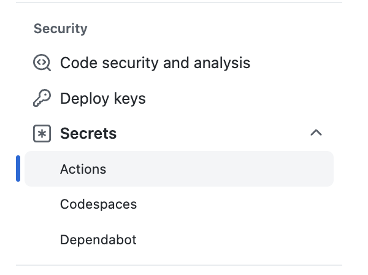

# 10 - Deploy to Kubernetes with GitHub Actionss

In this lab you will create a new Workflow that deploy the Node.js application as a service to Kubernetes.

A complete Kubernetes file is present in the project: `/kubernetes/deployment.yml`.

This file contains the following descriptor:

- A Kubernetes Namespace `workshop`
- A Kubernetes Deployment that deploy the container image created. The file use the place holder string `IMAGE_NAME` that will be replace during the GitHub Actions
- A kuberentes Service that use Kubernetes LoadBalancer to expose a public IP address  and port 3000


## 1 - Create a Secret with your Azure Credentials

This secret will be used to Login to Azure and use Azure CLI (`az`) to retrieve the Kubernetes Credentials.

GitHub encrypted secrets allow you to store sensitive information in your organization, repository, or repository environments. (See [Documentation](https://docs.github.com/en/actions/security-guides/encrypted-secrets))

-  Note: if you do not have an existing Azure Credential JSON run the following commands 
    ```

    az login

    az account list -o table

    # Get the subscription ID and use it in the following command

    az ad sp create-for-rbac --name "<A UNIQUE NAME>" --role "Contributor" --scopes /subscriptions/<YOUR SUBSCRIPTION ID> --sdk-auth -o jsonc

    ```


1- Go on your Repository Settings

2- In the left bar go to Security > Secrets > Actions
  

3- Click on "**New Repository secret**" 

4-Create a new Secret named `AZURE_CREDENTIALS`

5- Copy the JSON Credentials as value

6- Click **Add Secret** button to save it


## 2 - Change the Container visibility to Public

To simplify the process, we will use a public container image. *It is obsviously possible to use a private one, but for this we have to use some credentials from Kubernetes (or use ACR)*


1. Go to your repository home page (Code tab)

2. In the right menu click on your container, under the **Packages** section  


3. On the package page, click on **Packages Settings** 

4. Go on the botton of the page, uncheck "**Inherit access from source repository**"

5. Go on the botton of the page, and change the visibility to **Public**


Optional:

You can re-run the action to generate a new version of the container and use docker pull from your machine to test the fact that your container is now public.


## 3 - Create the Deployment workflow

In this step, you will create a new workshop that:

- on a new Release
- build and push a new image _(we could tag the existing one)_ with a tag with the release name
- deploy the application as Kubernetes resources

> Note: the complete workflow is available at `.github/solutions/release.yml` directory.

You can either copy the file, or create the fie using the following steps:

### 1 - Create a new workflow file `.github/workflows/release.yml`

(using Web IDE, Codespaces, or local IDE), name it:
  

### 2 - Enter the name and event that trigger the workflow

This workflow should be executed when a new [release](https://docs.github.com/en/enterprise-cloud@latest/repositories/releasing-projects-on-github/managing-releases-in-a-repository) is created.

Add the following section to your file:

```yml
name: 📦 Release and Deploy
on:
  release:
    types: [created]
```

### 3- Define environment variables

Add the following section with some environment variable that will be used in the workflow.

Adapt the Azure resource group, with your own environment, the image and image with tag names are based on GitHub Container Registry (`ghcr.io`) and repository name.

This section also use the git tag name (_release name_) as tag: `${{ github.event.release.tag_name }}`

```yml
env:
  AZ_RESOURCE_GROUP: "RG-AKSCluster" # Name of your Azure resource group
  AZ_CLUSTER_NAME: "AKS-000" # name of your kubernetes cluster in Azure
  IMAGE_NAME: ghcr.io/${{ github.repository }}:${{ github.event.release.tag_name }}
  IMAGE_NAME_WITH_TAG: ghcr.io/${{ github.repository }}:${{ github.event.release.tag_name }}
```

### 4- Build and publish the image 

Let's add, the `jobs` section and a job to build and run.

This is similar to what has been done in previous labs, just using a different tag.

```yaml
jobs:

  build_and_publish:
    runs-on: ubuntu-latest
    permissions: 
      contents: read
      packages: write 
    steps:

      - uses: actions/checkout@v2

      # Login against a Docker registry except on PR
      - name: Log into registry 
        uses: docker/login-action@v1.13.0
        with:
          registry: ghcr.io
          username: ${{ github.actor }}
          password: ${{ secrets.GITHUB_TOKEN }}


      - name: Build and push Docker image
        id: build-and-push
        uses: docker/build-push-action@v2.9.0
        with:
          context: .
          push: true
          tags: |
            ${{env.IMAGE_NAME}}
            ${{env.IMAGE_NAME_WITH_TAG}}

```

### 5 - Add a job to deploy to Kubernetes

The following job is executed once the `build_and_publish` is done (`needs`) and do the following steps:

  1. Checkout the code
  2. Login to Azure with `${{ secrets.AZURE_CREDENTIALS }}` 
  3. Get AKS credentials using `az aks get-credentials`
  4. Escaped the image to prepare a replacement
  5. Replace the image name inside the kubernetes deployment file 
  6. Apply the deployment to your kubernetes

```yaml
deploy_to_kubernetes:
    name: "🌩️ - Deploy to Kubernetes"            
    needs: build_and_publish
    runs-on: ubuntu-latest
    permissions:
      contents: read

    steps:

      - uses: actions/checkout@v2

      # login to azure
      - name: Login to Azure
        uses: azure/login@v1
        with:
          creds: ${{ secrets.AZURE_CREDENTIALS }}

      # get kubernetes credentials/context    
      - name: Get AKS Credentials
        id: getContext
        run: |
          az aks get-credentials --resource-group ${{ env.AZ_RESOURCE_GROUP }} --name ${{ env.AZ_CLUSTER_NAME }} --file $GITHUB_WORKSPACE/kubeconfig
          echo "KUBECONFIG=$GITHUB_WORKSPACE/kubeconfig" >> $GITHUB_ENV
      - name: "Escaping Image Name"
        run: |
          IMAGE_NAME_ESC=$(echo $IMAGE_NAME_WITH_TAG | sed 's/\//\\\//g')
          echo "IMAGE_NAME_ESC=$IMAGE_NAME_ESC" >> $GITHUB_ENV
      - name: "🌩️ - Deploy"
        run: |
          sed -i 's/IMAGE_NAME/${{env.IMAGE_NAME_ESC}}/g' kubernetes/deployment.yml
          kubectl apply -f ./kubernetes/deployment.yml 
          echo "🏁 - Application ${{ github.repository }} deployed to kubernetes"
```

Your release workflow is now complete.


### 5- Commit and Push to main

You can now commit and push your code. 

## 3 - Create a new release

## 4 - Test the new deployed application


## Conclusion

In this lab you have learned how to:

- 👏 use GitHub Actions to deploy an application to Kubernetes (AKS)

---

Next : 
  - **[Conclusion](099-conclusion.md)**
