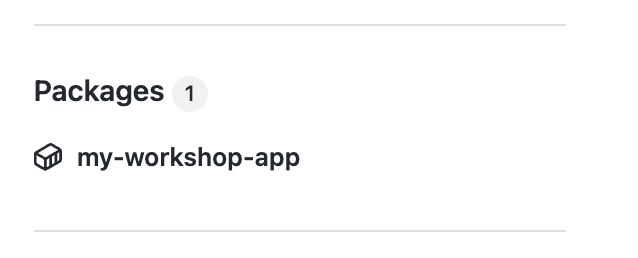
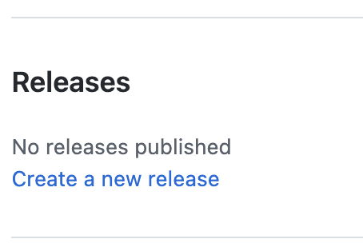

# 10 - Deploy to Kubernetes with GitHub Actions

In this lab you will create a new Workflow that deploy the Node.js application as a service to Kubernetes.

A complete Kubernetes file is present in the project: `/kubernetes/deployment.yml`.

This file contains the following descriptor:

- A Kubernetes Namespace `workshop`
- A Kubernetes Deployment that deploy the container image created. The file use the place holder string `IMAGE_NAME` that will be replace during the GitHub Actions
- A kuberentes Service that use Kubernetes LoadBalancer to expose a public IP address  and port 3000


## 1 - Create a Secret with your Azure Credentials

This secret will be used to Login to Azure and use Azure CLI (`az`) to retrieve the Kubernetes Credentials.

GitHub encrypted secrets allow you to store sensitive information in your organization, repository, or repository environments. (See [Documentation](https://docs.github.com/en/actions/security-guides/encrypted-secrets))

-  Note: if you do not have an existing Azure Credential JSON run the following commands 
    ```

    az login

    az account list -o table

    # Get the subscription ID and use it in the following command

    az ad sp create-for-rbac --name "<A UNIQUE NAME>" --role "Contributor" --scopes /subscriptions/<YOUR SUBSCRIPTION ID> --sdk-auth -o jsonc

    ```


1- Go on your Repository Settings

2- In the left bar go to Security > Secrets > Actions
  

3- Click on "**New Repository secret**" 

4-Create a new Secret named `AZURE_CREDENTIALS`

5- Copy the JSON Credentials as value

6- Click **Add Secret** button to save it


## 2 - Change the Container visibility to Public

To simplify the process, we will use a public container image. *It is obsviously possible to use a private one, but for this we have to use some credentials from Kubernetes (or use ACR)*


1. Go to your repository home page (Code tab)

2. In the right menu click on your container, under the **Packages** section  


3. On the package page, click on **Packages Settings** 

4. Go on the botton of the page, uncheck "**Inherit access from source repository**"

5. Go on the botton of the page, and change the visibility to **Public**


Optional:

You can re-run the action to generate a new version of the container and use docker pull from your machine to test the fact that your container is now public.


## 3 - Create the Deployment workflow

In this step, you will create a new workshop that:

- on a new Release
- build and push a new image _(we could tag the existing one)_ with a tag with the release name
- deploy the application as Kubernetes resources

> Note: the complete workflow is available at `.github/solutions/release.yml` directory.

You can either copy the file, or create the fie using the following steps:

### 1 - Create a new workflow file `.github/workflows/release.yml`

(using Web IDE, Codespaces, or local IDE), name it:

- `.github/workflows/release.yml`
  
The following workflow:

- is triggered by a new release
- push a new container image
- connect to Azure
- use `kubectl` to create a namespace and deploy the application

<details>
<summary>Complete workflow, copy and paste the code to `.github/workflows/release.yml`</summary>

```yaml
name: 📦 Release and Deploy
on:
  release:
    types: [created]
    
env:
  AZ_RESOURCE_GROUP: "tgrall-demo" # Name of your Azure resource group
  AZ_CLUSTER_NAME: "tug-kube" # name of your kubernetes cluster in Azure
  IMAGE_NAME: ghcr.io/${{ github.repository }}:${{ github.event.release.tag_name }}
  IMAGE_NAME_WITH_TAG: ghcr.io/${{ github.repository }}:${{ github.event.release.tag_name }}    
  
jobs:

  build_and_publish:
    runs-on: ubuntu-latest
    permissions: 
      contents: read
      packages: write 
    steps:

      - uses: actions/checkout@v2

      # Login against a Docker registry except on PR
      - name: Log into registry 
        uses: docker/login-action@v1.13.0
        with:
          registry: ghcr.io
          username: ${{ github.actor }}
          password: ${{ secrets.GITHUB_TOKEN }}


      - name: Build and push Docker image
        id: build-and-push
        uses: docker/build-push-action@v2.9.0
        with:
          context: .
          push: true
          tags: |
            ${{env.IMAGE_NAME}}
            ${{env.IMAGE_NAME_WITH_TAG}}
            
  deploy_to_kubernetes:
      name: "🌩️ - Deploy to Kubernetes"            
      needs: build_and_publish
      runs-on: ubuntu-latest
      permissions:
        contents: read

      steps:

        - uses: actions/checkout@v2

        # login to azure
        - name: Login to Azure
          uses: azure/login@v1
          with:
            creds: ${{ secrets.AZURE_CREDENTIALS }}

        # get kubernetes credentials/context    
        - name: Get AKS Credentials
          id: getContext
          run: |
            az aks get-credentials --resource-group ${{ env.AZ_RESOURCE_GROUP }} --name ${{ env.AZ_CLUSTER_NAME }} --file $GITHUB_WORKSPACE/kubeconfig
            echo "KUBECONFIG=$GITHUB_WORKSPACE/kubeconfig" >> $GITHUB_ENV
        - name: "Escaping Image Name"
          run: |
            IMAGE_NAME_ESC=$(echo $IMAGE_NAME_WITH_TAG | sed 's/\//\\\//g')
            echo "IMAGE_NAME_ESC=$IMAGE_NAME_ESC" >> $GITHUB_ENV
        - name: "🌩️ - Deploy"
          run: |
            sed -i 's/IMAGE_NAME/${{env.IMAGE_NAME_ESC}}/g' kubernetes/deployment.yml
            kubectl create namespace ${{ github.actor }} --dry-run=client -o json | kubectl apply -f - 
            kubectl apply -f ./kubernetes/deployment.yml --namespace=${{ github.actor }}
            kubectl -n  ${{ github.actor }} rollout restart deployment hello-world-node-deployment
            
            echo "🕚  - Wait 20s for service deployment"
            sleep 20s
            IP_SERVICE=$(kubectl get services -n ${{ github.actor }}  -o json | jq -r '.items[] | select(.metadata.name == "hello-world-node") | .status.loadBalancer?|.ingress[]?|.ip')
            echo "IP_SERVICE=$IP_SERVICE" >> $GITHUB_ENV
            echo "🏁 - Service ${{ github.repository }} update in ${{github.actor}} : http://$IP_SERVICE:3000 "            

```
</details>


You can now commit and push your code. 

## 3 - Create a new release

1- Go to the project home page, in the right menu click on "Release"
    

2- Click "Create a new release"

3- Use a Tag and generate release notes.

4- Click "Publish Release". This will run the workflow you have created before

## 4 - Test the new deployed application

The workflow will package and deploy the application to your Kubernetes.


The application is deployed in the `<your-github-handle>` namespace.

You can list the services, that exposes the application in this namespace using the Azure Portal or using the command line:

```
kubectl get services -n <your-github-handle>
```

If you do not have access to the CLI you can look in the GitHub Workflow logs, where the URL to the service is printed.

You can use the Public IP Address and port to access the application.

## Conclusion

In this lab you have learned how to:

- 👏 use GitHub Actions to deploy an application to Kubernetes (AKS)

---

Next : 
  - **[Conclusion](099-conclusion.md)**
